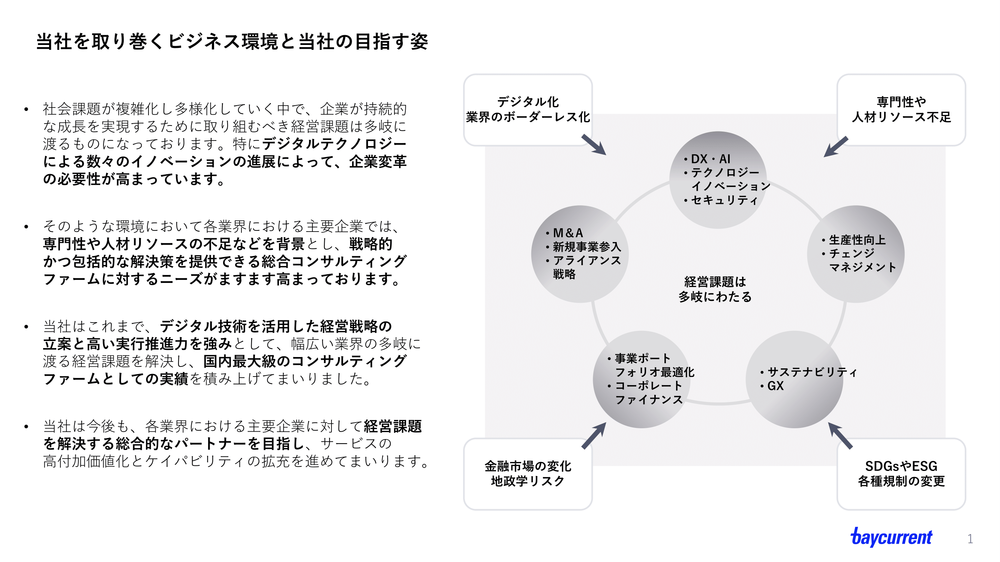
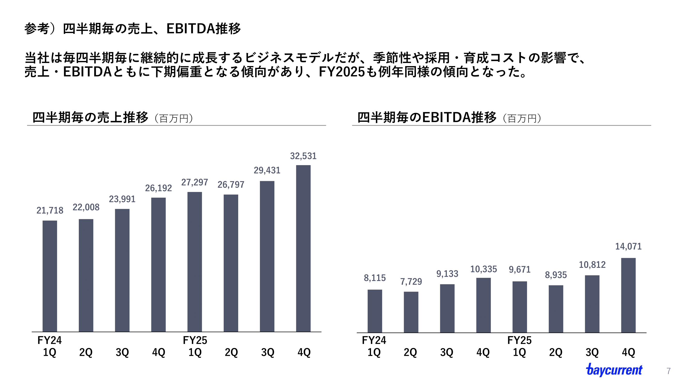
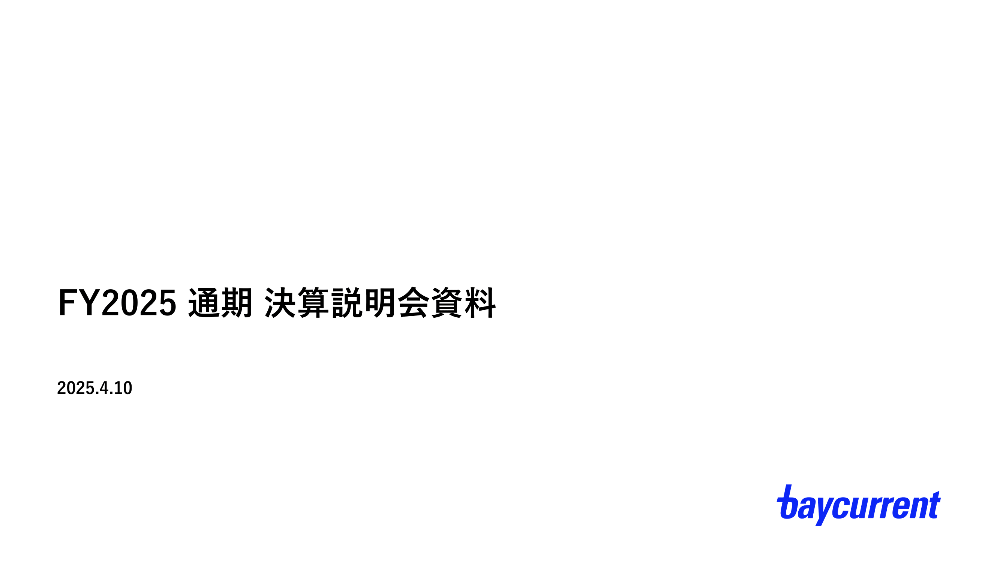
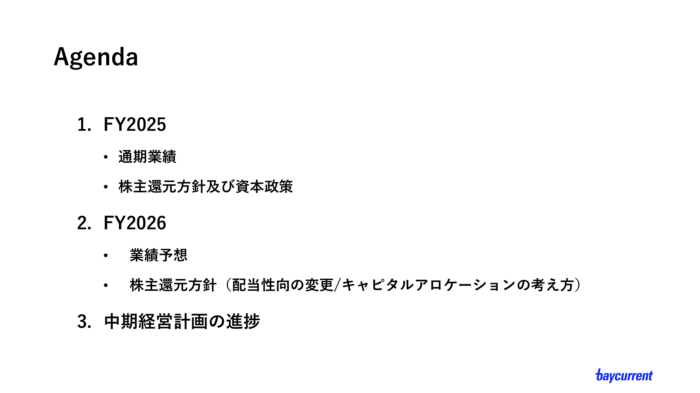

# PoC検証結果
## 検証目的
「マルチモーダルRAG」という技術に触れるにあたり、今までのテキストベースのRAGと比べて何が優れているのか確認する。
## 結論
- 参照したい資料に画像（もしくは画像化されたPDF）が多い場合、マルチモーダルRAGの利用はよい選択肢
  - テキストのみの参照に比べ、画像の情報を拾えることで回答精度が向上する
  - 生成時間は4倍ほどという結果が出たものの、待てない時間ではない（また、この数値はさらに改善可能）
  - 100 - 1000件程度のリクエストでは料金に大差はなく、コスパ良く実装できる
## 検証方法
1. app.py(テキストベースの回答生成)とapp_caption.py(マルチモーダルを活用した回答生成)をローカルPCで起動
2. それぞれのチャットボットに以下のプロンプトを指示
  - Q1: 売上高について教えてください 
  - Q2: 注力している事業について教えてください
3. 回答の精度・時間・料金を比べる。

## 回答結果
### テキストベースRAG
#### Q1回答
```
# 売上高について教えてください

提供された情報には、ベイカレント株式会社の売上高に関する具体的なデータは含まれていません。
売上高について知りたい場合は、ベイカレントの公式な財務報告書や決算発表資料を参照するか、
同社のIR部門に直接問い合わせることをお勧めします。
これらの資料は通常、同社のウェブサイトや金融情報を提供するプラットフォームで公開されています。
```
#### Q2回答
```
# 注力している事業について教えてください

提供された情報には、ベイカレント株式会社が注力している具体的な事業内容についての記載はありません。
ただし、収益認識の方針に関する情報から、同社が顧客に対する役務の提供を行っていることが示されています。
役務の提供は、顧客との契約に基づく期間にわたり行われるものであり、これが同社の主要な収益源の一つである可能性があります。

より具体的な事業内容や注力している分野については、ベイカレント株式会社の公式ウェブサイトや最新のIR資料、
プレスリリースなどを参照することをお勧めします。
これらの情報源には、同社の戦略的な事業展開や重点を置いている分野についての詳細が記載されていることが多いです。

```
### マルチモーダルRAG
#### Q1回答
```
# 売上高について教えてください

FY2025（通期）の売上高は、四半期別に以下のとおり推移し、下期に向けて伸長しています（単位：百万円）。

1Q：27,297
2Q：26,797
3Q：29,431
4Q：32,531
また、FY24も同様に下期に向けて増加しており、当社の売上は季節性（下期偏重）の傾向が継続しています。
```
**以下、出力画像**




---
#### Q2回答
```
# 注力している事業について教えてください

当社が注力している事業は、デジタル技術を活用した総合コンサルティング事業です。具体的には、企業変革ニーズの拡大を背景に、以下のような領域で主要企業の課題解決を支援しています。

DX／AI活用（業務・事業のデジタル化、データ活用高度化）
セキュリティ強化
生産性向上（業務改革、オペレーション最適化）
チェンジマネジメント（変革の定着支援）
M&A／新規参入、ポートフォリオ最適化
コーポレートファイナンス
サステナビリティ／GX対応（ESG、規制変更対応を含む）
これらを、当社の強みである**高い実行推進力（デジタル技術を活用した実行支援）**で一気通貫に提供し、国内最大級の総合コンサルとしてのポジション強化を進めています。
```
**以下、出力画像**




---

## 検証１）RAG回答精度比較
### 観点１　回答テキストの精度はどうか
- テキストベースRAG
  - テキストベースRAGでは、Q1・Q2ともに「提供された情報には記載がない」という前提に基づいた回答となっており、事実誤認はないものの、具体的な数値や事業内容には踏み込めていない。
  - 与えられたテキスト情報の範囲内で慎重に回答している点では安全性は高いが、ユーザーが求めている「売上高」や「注力事業」といった情報には到達できておらず、回答としては抽象的かつ限定的。

- マルチモーダルRAG
  - マルチモーダルRAGでは、画像内の決算資料・説明資料を正しく参照し、Q1では四半期別の売上高数値を具体的に提示できている。数値の整合性や傾向（下期偏重）についての要約も適切であり、回答テキストの精度は高い。
  - Q2についても、スライドに記載された事業領域を抽出・整理できており、単なる列挙に留まらず、「総合コンサルティング事業」「実行推進力」といった文脈付けもできているなど、精度・解像度ともに高い。
### 観点２　ほしい情報にアクセスできているか
- テキストベースRAG
  - 売上高や注力事業といった情報が、テキストとして明示的に含まれていない場合、それ以上の推論や補完ができず、ユーザーが本当に知りたい情報にはアクセスできていない。
    - 今回の場合、参照したPDFに表が多く、表の情報はくみ取ることができなかった
  - 結果として、「IR資料を参照してください」という誘導的な回答に留まり、RAGとしての情報取得価値は限定的である。

- マルチモーダルRAG
  - 画像を含めたマルチモーダルな情報ソースにアクセスできることで、テキストベースでは欠落していた「数値」「事業領域一覧」「経営メッセージ」といった情報に直接到達できている。
  - 特に、IR資料や決算説明スライドのように重要情報が画像（PDFスライド）として提供されるケースでは、ユーザーの期待する回答に直結する情報取得が可能であり、マルチモーダルとしての有効性が明確に確認できた。
  - ただし、画像検索の精度があまりよくなく、アジェンダやカバースライドを回答に採用している。それらはそもそも検索させない、などの工夫も必要か。


## 検証２）生成時間
二つのプロンプトに対する回答時間の平均で算出した
### テキストベースRAG 
約7.13秒/prompt（Q1: 8.56秒、Q2: 5.70秒）
### マルチモーダルRAG
約33.74秒/prompt（Q1: 34.45秒、Q2: 33.03秒）
### まとめ
- 回答速度についてはおよそ4~5倍の差が出た。
  - 30秒を超えると「長い」と感じるユーザーも多いだろうから、この点に関しては改善の余地あり。
- 改善の余地としては、今回のPoCでは、毎回の検索ごとに画像のキャプションを生成している点があげられる。
  - キャプションを事前に作成してデータベース化しておき、画像ファイルと紐づけを行えば、キャプション作成の分の時間をカットできる。（体感としては、これで生成時間が半分ほどになるのではないか...）

## 検証３）生成料金
### テキストベースRAG 
約0.01\$/prompt（Q1: 0.01\$、Q2:0.01\$ ）
### マルチモーダルRAG
約0.025\$/prompt（Q1: 0.02\$、Q2: 0.03\$）
### まとめ
- 価格差は一回の質問あたり0.015ドル（＝2.38円）となった。
  - 法人プロジェクトであれば~10万/月程度の予算は確保できると考えると、10,000質問ぐらいであれば許容範囲。
  - 参考までに、Googleでの「ベイカレント」の検索回数は、直近5年で多くても100回ほど（Google trends調べ）
    - 実際にはその他キーワードとの組み合わせもあるのでもう少し増えるだろうが、その中からIRを訪ね、チャットで質問をし…という人数はそこまで多くないと考えられる。（かなり多めに見積もって1000人/月ほど？）
      - そう考えると許容範囲の料金感。