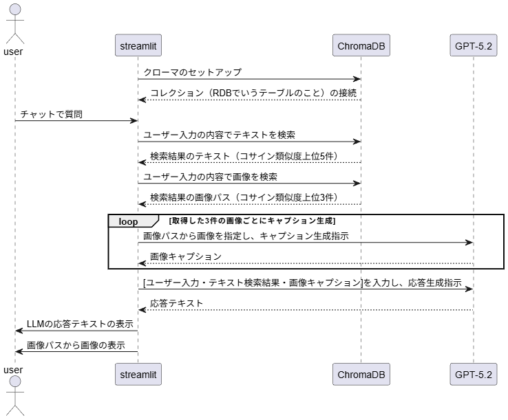

# AI RIZAP：マルチモーダルRAG PoC

## 概要
本リポジトリは、マルチモーダル（テキスト/画像）を利用した **RAG（Retrieval-Augmented Generation）** のPoCです。  
ドキュメントを取り込み、埋め込み（Embedding）と検索（Retrieval）を行い、**画像とテキストを組み合わせた応答**や、**画像キャプション生成**を試験することを目的としています。

**最終的な検証結果は[./PoC_documents/PoC_検証結果](./Poc_documents/PoC_検証結果.md)に格納しています。結論が知りたい方はそちらへ**

---

## クイックスタート（Windows / Miniconda）

### 1) 環境作成・依存インストール
```powershell
conda create -n mmrag python=3.10 -y
conda activate mmrag

# app_caption.pyが格納されているフォルダまでcdする。その後下記実行
pip install -r requirements.txt
```

### 2) 環境変数（.env）を作成
プロジェクト直下に .env を作り、[OpenAI APIキー](https://platform.openai.com/api-keys)を設定します。
```
OPENAI_API_KEY=your_openai_api_key_here
```

### 3) ChromaDBへデータ投入（初回必須）
初回は ChromaDB にデータを投入してください。DBが空の場合、検索結果は返りません。(ベイカレントIRについてはデータ投入済み)
```
jupyter lab chroma_data_loard.ipynb
```

### 4) アプリ起動（Streamlit）
```
streamlit run app_caption.py
```

## 使い方
### app_caption.py（キャプション強化版）
画像にキャプションを生成し、その情報をプロンプトへ組み込み、応答精度を高めます。
```
streamlit run app_caption.py
```

### chroma_data_loard.ipynb（ChromaDB操作）
ChromaDBの作成、データ追加、一覧表示、削除等を行うノートブックです。
```
jupyter lab chroma_data_loard.ipynb
```

### REF: app.py（マルチモーダルRAGのプロトタイプ。app_caption.pyの下位互換なので基本使わなくてよい）
テキスト検索 + 画像検索を行い、回答と関連画像を返します。app_caption.pyのもとになったコードです。
```
streamlit run app.py
```

## フォルダ構成
- app_caption.py : マルチモーダルRAGのメインアプリ(streamlit)

- chroma_data_loard.ipynb : ChromaDBの作成・データ追加等を行うノートブック

- PoC_documents/ : 仕様書・PoC計画書・検証結果などのドキュメント

- .images/＆.pdf/ : サンプルの画像・PDFデータ

- chroma_db/ : ChromaのローカルDB（SQLite）とストアディレクトリ

- .csv/ : ChromaDBに保存されているデータの一覧（メタデータ含む）

- app.py : app_caption.pyのプロトタイプ。画像の情報をプロンプトに読ませられない。（Streamlit）
## 処理フロー（概略）

データ取り込み → 前処理 → 埋め込み生成 → Chromaへ格納
クエリ時: クエリ埋め込み → Chromaで近傍検索 → 検索結果（テキスト＋画像）を生成モデルへ渡して応答

### フローチャート

